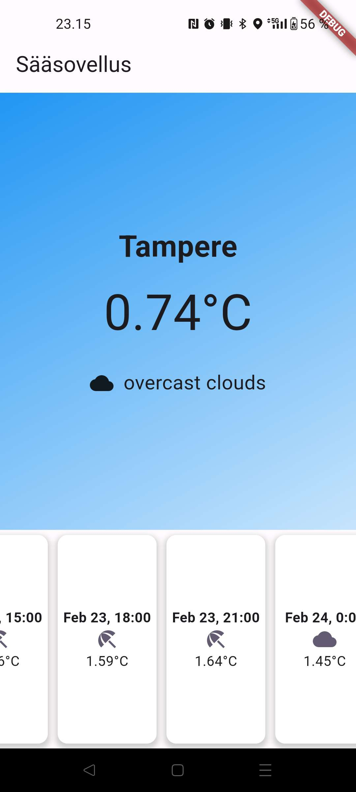

## Basic Flutter Weather App

This weather app is a simple yet functional application developed with Flutter. It fetches weather data from the OpenWeatherMap API, currently configured to display the weather for Tampere.

### App Screenshots

Below are the main interfaces of the app, showcasing its design and functionality:

  

    
<strong>Main Screen<strong/>

     
    
  

  

    
<strong>Weekly Forecast Screen<strong/>

     
    
  

